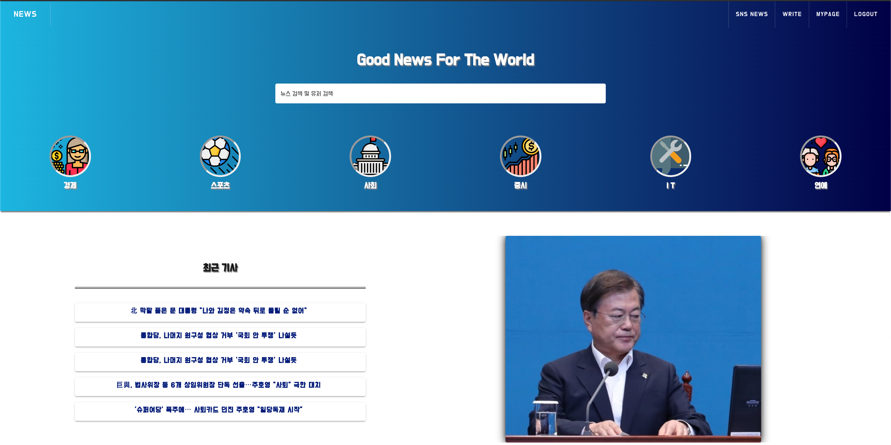
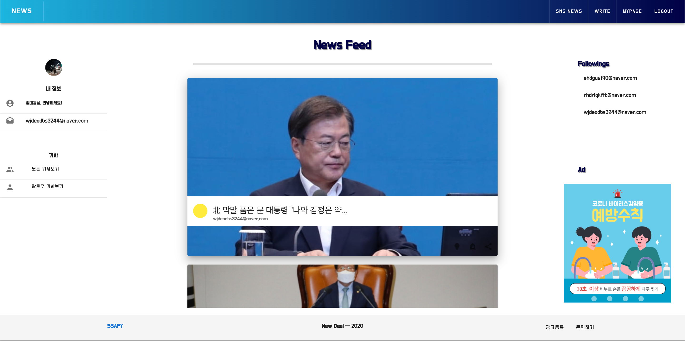
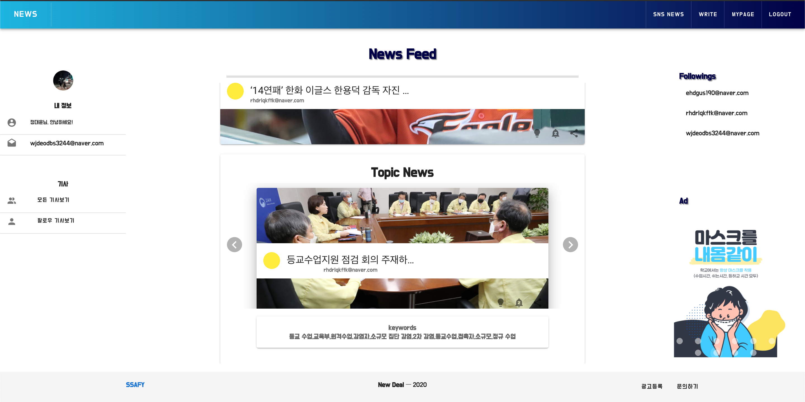
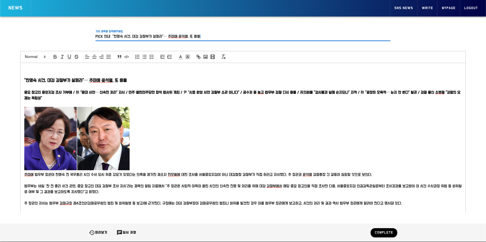
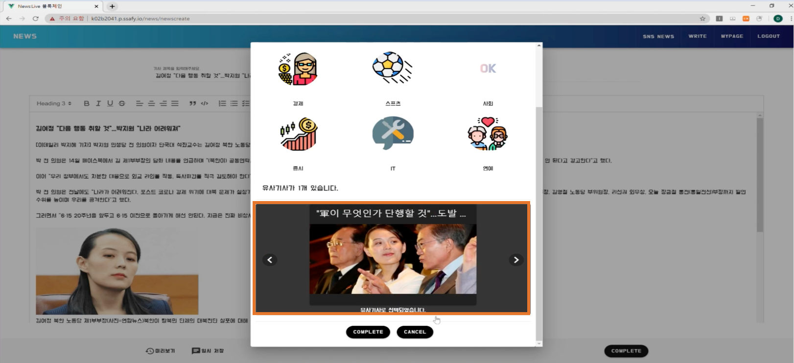
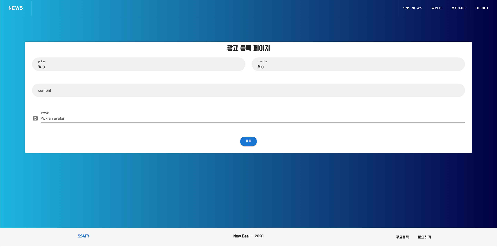
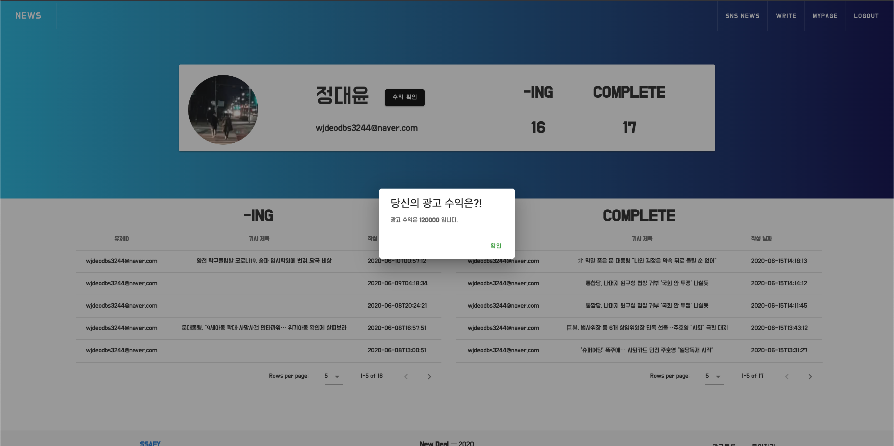
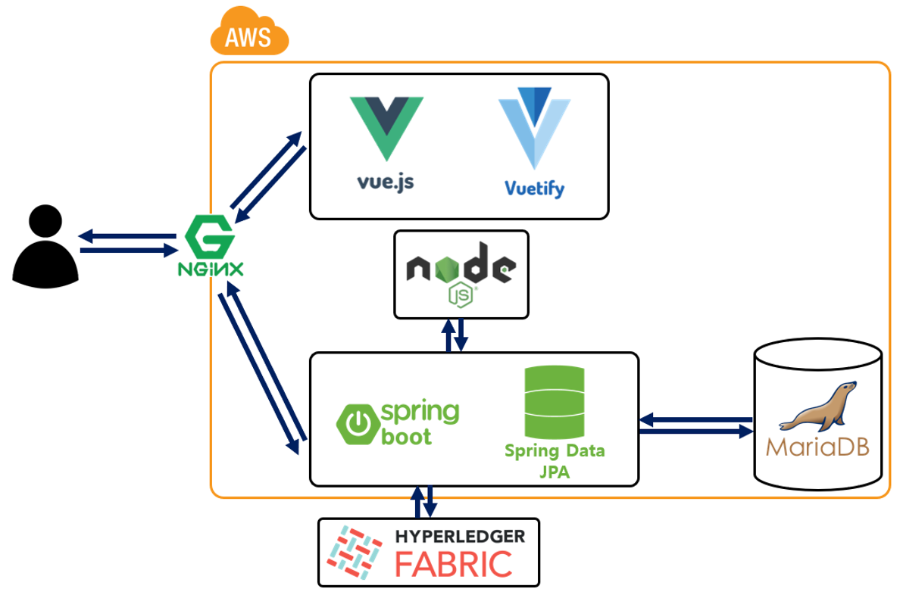

# <뉴스 라이브 : 블록체인 기반 뉴스 플랫폼 >


## 팀명 : 뉴딜


### 서비스 설명

#### 뉴스 라이브 : 블록체인 기반 뉴스 플랫폼

현대인들은 뉴스를 인터넷 매체를 통해 대기업, 보도 매체에 의한 선별된 기사, 의도를 가지고 작성한 기사, 똑같은 기사를 무분별하게 받아들이고 있습니다. 또한 기자들은 이익 또는 억압에 의해 저널리즘을 발휘하지 못하고 이익을 위한 의도적인 기사를 작성하며 교묘하게 처벌을 피해가고 있습니다.

 이에 따라 기자의 뉴스 배포 이후의 배포, 수정, 삭제, 신고 내역을 블록체인에 저장 및 공개합니다. 
블록체인으로 탈중앙화되어 운영되는 프랫폼을 통해 기자는 대기업, 자본, 매체에 의한 억압에서 벗어 날 수 있으며, 오로지 구독자의 신고 즉, 민주적인 절차에 의해서만 재약을 받습니다.

또한 모든 뉴스의 정보가 저장됨에 따라 기자는 자신의 작성한 기사로 부터 온전한 책임을 갖게 되어 법적 분쟁 및 사회적 책임에 대한 증거 자료로서 활용될 수 있습니다. 


### 서비스 소개

##### 1. News Live 메인 페이지



##### 2. 주요 기능

​	2-1. SNS 페이지



​	

- 모든 뉴스를 확인하며, 팔로우한 사람의 기사를 볼 수 있는 SNS 페이지 입니다. 유사기사가 있을 경우 아래의 사진처럼 모아 보여줍니다.
- 팔로우 및 광고를 확인할 수 있습니다.


​	2-2. 기사 작성



- 기사를 작성하며 임시저장을 할 수 있는 페이지 입니다. Vue 에디터를 사용하여 실제 에디터들 처럼 사용할 수 있습니다.


​	2-3. 기사 등록



- 기사 등록할 경우 사진과 같이 카테고리 선택 및 유사기사를 형태소 기반으로 추출하여 보여주고 유사기사를 선택할 수 있습니다.


​	2-4. 광고 등록



- 광고 등록을 할 수 있으며 SNS 페이지에서 확인할 수 있습니다.


​	2.5. 마이 페이지



- 작성 중인기사(임시저장) 완료한 기사에 대한 리스트를 볼 수 있습니다.
- 블록체인으로 부터 공정하게 분배받은 수익을 확인할 수 있습니다.


### 기술 상세

#### 1. Back-End

##### 📝 Feature

- JDK 1.8
- [Gradle](https://gradle.org/) 4.10.2
- [Spring Boot](https://spring.io/projects/spring-boot) 2.2.1
- [Swagger](https://swagger.io/) 2
- [Hyperledger Fabric Java SDK](https://github.com/hyperledger/fabric) 1.4


##### ⚙️Getting Started

##### Installation

1. Clone the repository

   ```
   git clone https://github.com/Wooojiin/news_blockchain.git
   ```

2. Install 

   ```ubu
   sudo apt-get update
   sudo apt-get install openjdk-8-jdk
   ```


##### Usage

1. Create `application-key.properties` File at `news_blockchain/src/main/resources/`

   ```properties
   naver.clientId = "Your naver API Information"
   naver.clientSecret = ""Your naver API Information"
   
   
   fabric.caServer.url = "Your Fabric Network Information"
   fabric.caServer.adminName = "Your Fabric Network Information"
   
   fabric.org.name = "Your Fabric Network Information"
   fabric.org.mspName = "Your Fabric Network Information"
   fabric.org.adminName = "Your Fabric Network Information"
   fabric.org.userName = "Your Fabric Network Information"
   fabric.org.userSecret = "Your Fabric Network Information"
   
   fabric.peer.name = "Your Fabric Network Information"
   fabric.peer.url = "Your Fabric Network Information"
   
   fabric.orderer.name = "Your Fabric Network Information"
   fabric.orderer.url = "Your Fabric Network Information"
   
   fabric.channel.name = "Your Fabric Network Information"
   ```

2. Modify `WebConfig.java` and `AdvertisementService.java`

   1. Run only Localhost

      - `WebConfig.java`

        ```java
        @Configuration
        public class WebConfig implements WebMvcConfigurer {
        
            @Override
            public void addCorsMappings(CorsRegistry registry){
                registry.addMapping("/**")
                        .allowedOrigins("*")
                        .allowedMethods("*");
            }
        }
        ```

      - `AdvertisementService.java`

        ```java
        public static final String SAVE_FOLDER = "Your Project save Folder" +  "/news_blockchain/src/main/resources/static/image/";
        public static final String IMAGE_URL = localhost:8080/image/";
        ```

   2. Others

      - `WebConfig.java`

        ```java
        @Configuration
        public class WebConfig implements WebMvcConfigurer {
        
            private String urlPath;
        
            public WebConfig() {
                this.urlPath = "Your Save Folder";
            }
        
            @Override
            public void addResourceHandlers(ResourceHandlerRegistry registry) {
                registry.addResourceHandler("/image/**").addResourceLocations(urlPath).setCachePeriod(20);
            }
        
            @Override
            public void addCorsMappings(CorsRegistry registry){
                registry.addMapping("/**")
                        .allowedOrigins("*")
                        .allowedMethods("*");
            }
        }
        ```

      - `AdvertisementService.java`

        ```java
        public static final String SAVE_FOLDER = "Your save Folder";
        public static final String IMAGE_URL = "Your url" + "/image/";
        ```

3. Build

   ```
   cd news_blockchain
   sudo chmod +x gradlew
   ./gradlew build
   ```

4. Run

   ```
   cd build/lib
   java -jar news-1.0-SNAPSHOT.jar
   ```

5. Swagger

   - Run on Localhost

     `http://localhost:8080/swagger-ui.html#`

   - Others

     `Your Url + "/swagger-ui.html#"`

#### 2. Front

##### 	📝 Feature

- [vue.js](https://kr.vuejs.org/) @vue/cli 4.3.1
- [vuetify](https://vuetifyjs.com/ko/) 2.0.4


##### 	⚙️Getting Started

1. Install 

   ```ubu
   $ npm i vue vuex vuetify vue-router
   $ npm install vue
   $ vue create my-app
   ```

2. Compiles and hot-reloads for development

   ```
   npm run serve
   ```

3. Compiles and minifies for production

   ```
   npm run build
   ```

4. Run your tests

   ```
   npm run test
   ```

   Customize configuration
   See [Configuration Reference](https://cli.vuejs.org/config/).


##### ⚙️Structure

1. 홈

   ```ubu
   Home.vue 
   ├─ SubHome.vue // 최근 기사, 페이지 소개 , 블록체인 소개 
   └─ Catalogy.vue // 6가지 뉴스 테마 카탈로그
   ```

2. 마이 페이지

   ```ubu
   Mypage.vue // 사용자의 완료된 기사 및 수익 확인 
   └─ MypageInfo.vue 
   ```

3. 광고 페이지    

   ```ubu
   Advertisement.vue // 광고 페이지  
   └─ components(advertisement) 
     ├─ AdBanner.vue // 광고 카드
     └─ AdCreate.vue // 광고 작성 
   ```

4. SNS 뉴스피드 페이지

   ```ubu     
   SnsNews.vue // Sns뉴스피드 
      └─ components(news)
         ├─ NewsDetail 
         │   ├─ FollowNews.vue // 팔로우한 사람의 뉴스
         │   └─ AllNews.vue // 모든 뉴스      
         │
         ├─ NewsCreate.vue // 뉴스 작성
         ├─ NewsDetail.vue // 뉴스 자세히 보기
         └─ NewsFeed.vue // 뉴스 메인 피드
   ```

5. 그 외    

   ```ubu     
   components(common) // 네비바, 푸터, 로딩 페이지 
   ├─ NewsNav.vue // 홈, Sns, 광고, 로그인 버튼
   ├─ NewsFooter.vue // 싸피 홈페이지 버튼
   ├─ NewsEach.vue 
   └─ LoadingPage.vue    
   ```


#### 기술 스택

|                                  | Framework & 기술                       | Language                    |
| -------------------------------- | -------------------------------------- | --------------------------- |
| :earth_asia: Back-End            | Spring-boot, HiberNate, Nginx, Node.js | JAVA(1.8.0), Node.v12.16.2) |
| :globe_with_meridians: Front-End | VUE, vuex, Node v12.14.                | javascript(es6), typescript |
| :mailbox_with_no_mail: DB        | WorkBanch, docker                      | MariaDB                     |
| :foggy: BlockChain               | Hyperledger-Fabric, Ethereum           | solidity(0.4.24), Go        |


#### 구성도




### 팀 및 역할


|                                  |            |      |
| -------------------------------- | ---------- | ---- |
| :bicyclist: 안우진               | Back-end   |      |
| :blue_book: 홍정우 (구 : 홍순범) | Back-end   |      |
| :soccer: 정대윤                  | BlockChain | 팀장 |
| :art: 김정원                     | Front-end  |      |
|                                  |            |      |

<hr>

## Git Commit 메세지 분류

| Commit type          | Emoji                                            |
| -------------------- | ------------------------------------------------ |
| 최초 커밋 : init     | 🎉 `:tada:`                                       |
| 기능 추가  : feat    | 🆕 `:new:`                                        |
| 버스 픽스 : fix      | 🐛 `:bug:`                                        |
| 문서화 : docs        | 📝 `:memo:`                                       |
| 디자인 수정 : design | 🎨 `:art:`                                        |
| 코드개선 : refactor  | 🔨 : `:hammer:`                                   |
| Other                | [Be creative](http://www.emoji-cheat-sheet.com/) |


ex)

:new: feat : backend 게시글 등록 기능 추가

(내용은 되도록이면 한글로)
